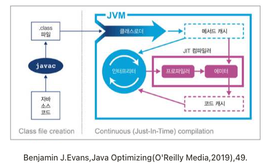
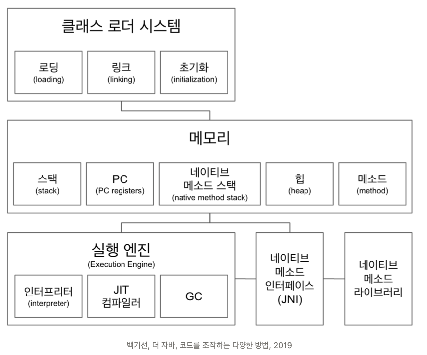
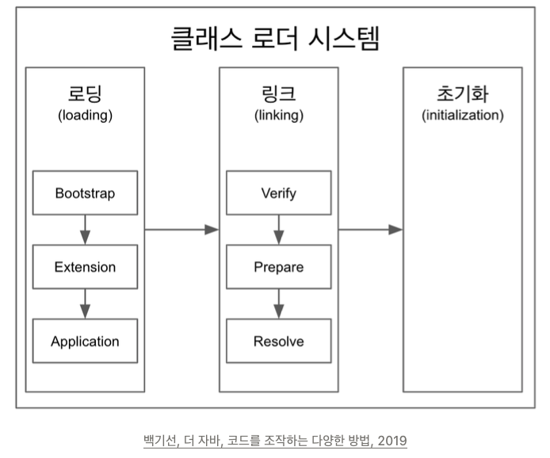
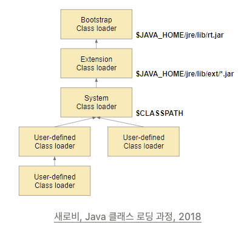

# JVM and ClassLoader

## WORA(Write Once Run Anywhere)
[컴파일러와 인터프리터의 기계어 번역 과정]

- 컴파일
    - 플랫폼 종속적(dependent)
    - 소스코드를 한번에 번역
    - 빠르다
- 인터프리터
    - 플랫폼 비종속적(independent)
    - line-by-line 으로 기계어 번역
    - 느리다

- 컴파일러는 플랫폼 종속적이지만, 언어는 플랫폼 비종속적
- 자바는 WORA를 컴파일러와 인터프리터 두 개다 사용함으로써 극복
- 사실 자바 컴파일러(javac)는 C의 gcc나 visual c와 같은 excutable 파일을 만드는 것이 목적이 아니라, 소스코드들을 JVM(Java Virtual Machine)이 이해할 수 있는 바이트 코드(.class)로 번역하는 것이 목적
- 플랫폼 종속적인 부분을 JVM을 통해서 해결하고자 한 것으로, 자바 코드를 실행하고자 하면 JVM 이라는 가상머신 위에서 돌아가서 플랫폼의 영향을 안받게 하고자 한것

자바의 목표인 WORA는 자바 소스코드 -> JVM -> 네이티브 코드 변환의 순서로 해당 목표 실현
- Java 코드를 작성하면 어떤 플랫폼이든 네이티브 코드로 변환해줄 수 있는 JVM만 있으면 되는데 그렇다면 왜 JAVA에서 인터프리터를 사용하는 이유는 무엇일까?
    - 인터프리터가 실질적으로 JVM에 저장된 자바 바이트 코드를 네이티브 코드로 번역
    * 자바 소스코드 -> 자바 컴파일러 -> 자바 바이트 코드 -> JVM -> 자바 인터프리터 -> 네이티브 코드
    * 반복적인 코드는 JIT 컴파일러(바이트 -> 네이티브)한테 보내서 미리 바꿔서 저장, 인터프리터는 해당 구문을 만나면 저장해둔 결과를 가져와서 네이티브 코드로 바꿔서 수행하는 로직 수행

## JVM 구조
자바 컴파일로의 역할은 자바 소스코드(.java)를 자바 바이트 코드(.class)로 변환 후, JVM에 로딩, 이 자바 컴파일러에 의해 생성된 자바 바이트 코드를 JVM의 클래스 로더 시스템을 활용하여 메모리에 적재한 후에 실행 엔진에서 런타임 시, 인터프리터와 JIT 컴파일러를 활용하여 실제 자바 바이트 코드 -> 네이티브 코드로 변환하여 실행

1. 실행될 클래스 파일을 메모리에 로드 후 초기화 작업 수행
2. 메소드와 클래스 변수들을 해당 메모리 영역에 배치
3. 클래스 로드가 끝난 후, 지역변수, 객체변수, 참조변수를 스택영역에 쌓음
4. 다음 라인을 진행하면서 상황에 맞는 작업 수행

JVM은 위와 같은 구조로 설계되어 있음

### 클래스 로드 시스템 영역(Class Loader System Area)

자바 바이트 코드를 읽고 메모리에 적재하는 역할을 수행하는데 메모리를 적재하는 과정은 크게 3개로 나뉜다
- 로딩(Loading): 클래스 파일에서 가져와서 JVM 메모리에 로드
- 링킹(Linking): 레퍼런스를 연결하는 과정
- 초기화(Initialization): static 한 값들을 초기화

자바의 동적로딩이 가능한 이유가 바로 이 클래스 로더 때문이다.
 - BootStrap ClassLoader -> Extension ClassLoader -> Application(= System) ClassLoader 순서대로 실행
 - 자바는 확장성이 좋은 언어다 보니 직접 클래스로더를 구현해서 사용, 이러한 것들을 사용자 정의 클래스로더(User-Defined ClassLoader) 라 부르며, 이런 클래스 로드들은 Application ClassLoader 이후에 로딩

클래스 로더의 특징
- 클래스 로더는 계층적(Hierarchical) 이다
- 클래스 로더는 가시적인 규약(Visible Contract)을 갖고 있다
- 클래스 로더는 위임형 로드 요청(Delegation Load Request)의 특징을 갖고 있다
- 클래스 로더에 로드된 클래스는 언로드가 불가능하다

* 클래스 로드는 계층적이다.
  - 위의 그림과 같이 최상위 부모 클래스는 BootStrap ClassLoader 이고, 그 밑에 부모-자식 관계를 갖고 있다

* 클래스로더는 가시적인 규약을 갖고 있다
  - 자식 클래스 로더에서 찾지 못한 클래스 -> (위임) 부모 클래스 로더에서 찾을 수 있음
  - 부모 클래스 로더에서 찾지 못한 클래스 -> 자식 클래스 로더에서 찾을 수 없음
  - 즉 하위 클래스 로더는 상위 클래스 로더의 Class 를 위임형 로드 요청(Delegation Load Request) 를 통해서 찾을 수 있지만 반대는 불가능 하다
  - 또한 상위 클래스 로더가 같은 하위 클래스 로더는 서로 로딩한 클래스를 사용할 수 없다는 룰을 가시적인 규약
  
* 클래스 로드는 위임형 로드 요청(Delegate Load Request) 특징을 갖고 있다
  - 상위 클래스 로더가 로딩한 클래스가 우선권을 갖는 것을 위임형 로드 요청
  
* 클래스 로더에 로드된 클래스는 언로드가 불가능하다
  - 클래스 로더에는 클래스 언로딩(Unloading) 기능이 없다. 따라서 언로딩을 하기 위해서는 Class Loader 자체를 삭제하고 재생성해야 한다

### 메모리 영역 (Runtime Data Area)
JVM이 운영체제 위에서 실행되면서 항당받는 영역으로, ClassLoader 에서 준비한 데이터들을 보관한다. 메모리 영역은 크게 모든 쓰레드가 공유하는 영역과 쓰레드 별로 하나씩 생성되는 영역을 나뉘어진다.

1. 모든 스레드가 공유하는 영역
  - 메소드 영역(Method Area)
  - 힙 영역(Heap Area)

2. 스레드 별 하나씩 생성되는 영역
  - 스택 영역(Stack Area)
  - 네이티브 메소드 영역(Native Method Stack Area)
  - PC 레지스터(PC Register)

- 메서드 영역
  - 클래스 수준의 정보(클래스 이름, 부모 클래스 이름, 메소드, 변수) 저장하는 영역
  - 메서드 영역은 사실 클래스 영역(Class Area) 이라고도 부르고 정적 영역(Static Area) 이라고도 부름
  - 클래스 수준의 정보가 저장된다는 뜻은 클래스 파일의 바이트 코드가 로드 되는 곳
  - 즉 JVM 이 시작될 떄 생성되는 영역이며, JVM 이 읽어 들인 각각의 클래스와 인터페이스에 대한 정보들이 보관

- 힙 영역
  - 힙 영역에는 객체를 저장하는 영역
  - 즉 Person p = new Person(); 을 수행하면 해당 인스턴스 변수가 놓이는 영역
  - 생성된 인스턴스는 가비지 컬렉터에 의해 지워지거나 JVM 이 종료될 때까지 힙 영역에 남아있게 된다

- 스택 영역
  - 스레드마다 런타입 스레드를 만들고 그 안에 메서드 호출(Method Call) 을 스택 프레임이라 부르는 블럭에 쌓는다. 스레드가 종료하면 런타임 스택도 사라진다

- PC 레지스터
  - 스레드마다 스레드 내 현재 실행한 스텍 프레임을 가르키는 포인터가 생성

- 네이티브 메소드 스택
  - 자바 외의 언어로 작성된 네이티브 코드를 위한 스택이다. 이 때 네이티브 메소드 인터페이스를 통해 호출하는 코드들을 위한 스택이라고 생각
  - 스레드마다 생성되는 네이티브 메소드 사용 시 별도로 생성되는 스택

### 실행 엔진(Execution Engine)
클래스 로더를 통해 JVM 내 런타임 데이터 영역에 배치된 바이트코드들이 실제 실행되기 위해 사용되는 영역

- 인터프리터
  - 자바 바이트 코드를 한 줄 씩 실행(느린 단점을 보완하기 위해 JIT 컴파일러 사용)

- JIT 컴파일러
  - 인터프리터의 단점을 보완하기 위해 도입
  - 반복적인 코드는 JIT 컴파일러(바이트 코드 -> 네이티브 코드) 한테 보내서 미리 바꿔서 저장해둔다. 인터프리터는 해당 구문을 만나면 저장해둔 결과를 가져와서 네이티브 코드로 바꿔서 수행

- GC(Garbage Collector)
  - 애플리케이션이 생성한 객체의 생존 여부를 판단하여 더 이상 사용되지 않는 객체를 해제하는 방식으로 메모리 자동 관리

## 클래스 로딩 과정 (Class Loading Process)
1. 로딩(Loading)
  - 클래스 로더가 바이트 코드를 읽고 그 내용에 따라 적절한 바이너리 데이터를 만들고 메서드 영역에 저장한다 (JVM의 메모리에 로드)
  - 이 때 메소드 영역에는 다음과 같은 데이터들이 저장된다
    - FQCN(Fully Qualified Class Name)
    - 클래스인지 인터페이스인지 이늄인지 구분
    - 메소드와 변수
  - 로딩을 하고 나면 해당 클래스 타입의 Class<?> 객체를 생성하여 힙 영역에 저장

2. 링킹(Linking)
  - 링킹은 세 가지 단계로 나뉘어 짐
    1. 검증(Verify): .class 파일 형식이 유효한지 검증
    2. 준비(Prepare): 메모리를 준비하는 과정으로 static 변수와 기본 값에 필요한 메모리를 준비
    3. 분석(Resolve): 심볼릭 메모리 레퍼런스를 메소드 영역에 있는 실제 레퍼런스로 교환(Optional)

